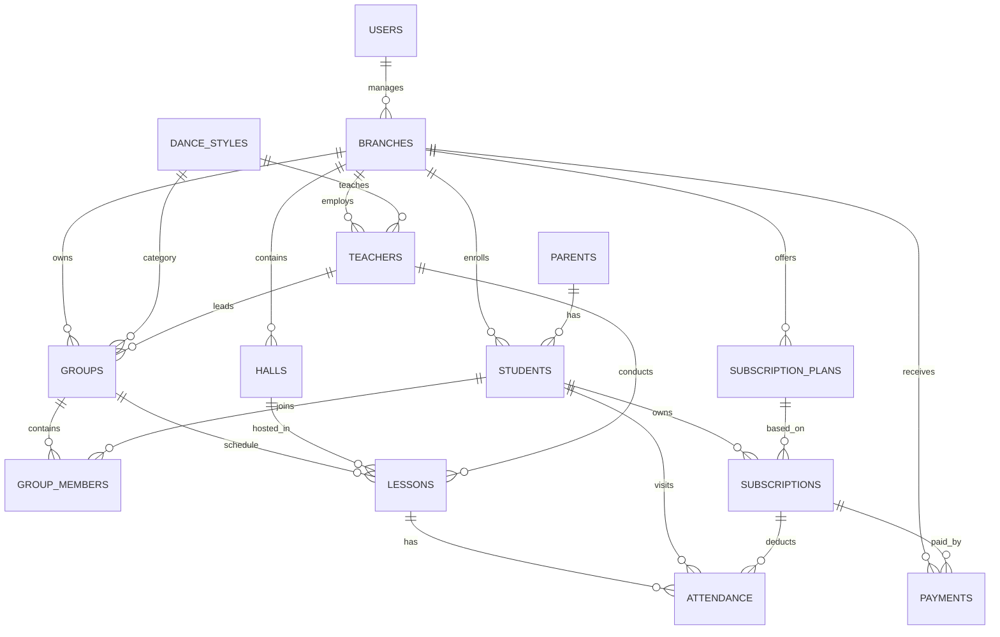

# Dance CRM

Backend CRM-система для сети школ танцев, разработанная на **FastAPI**. Проект автоматизирует работу филиалов: управление учениками, родителями, группами, расписанием, абонементами, посещаемостью и платежами.

---

# Возможности

- JWT-аутентификация
- Ролевая модель (`owner`, `branch_admin`)
- Управление филиалами и залами
- Управление родителями и учениками
- Управление танцевальными направлениями
- Управление преподавателями (как бизнес-сущностями)
- Управление группами
- Расписание занятий
- Учёт посещаемости
- Абонементы и тарифные планы
- Учёт платежей
- REST API с OpenAPI-документацией
- Асинхронная работа с PostgreSQL

---

# Стек технологий

### Backend

- Python 3.14
- FastAPI
- SQLAlchemy 2.0 (Async)
- Pydantic v2
- Alembic
- asyncpg
- Uvicorn

### База данных

- PostgreSQL 16

### Авторизация

- JWT
- OAuth2 Password Flow

### Тестирование

- pytest
- pytest-asyncio
- httpx

### Инфраструктура

- Docker
- Docker Compose
- Git
- pre-commit
- Black
- isort
- Flake8
- mypy

---

# Архитектура

Проект построен по многослойной архитектуре.

```text
Request
   │
Router
   │
Service
   │
Repository
   │
PostgreSQL
```

Каждый бизнес-модуль содержит собственные модели, схемы, сервисы, репозитории и маршруты.

---

# Структура проекта

```text
app/
├── core/
├── db/
├── modules/
│   ├── auth/
│   ├── branches/
│   ├── halls/
│   ├── parents/
│   ├── students/
│   ├── teachers/
│   ├── dance_styles/
│   ├── groups/
│   ├── schedule/
│   ├── attendance/
│   ├── subscription_plans/
│   ├── subscriptions/
│   ├── payments/
│   ├── reports/
│   └── users/
├── shared/
└── main.py

tests/
scripts/
alembic/
```

---

# Быстрый старт

## Клонирование проекта

```bash
git clone https://github.com/polinenysh/dance-crm.git
cd dance-crm
```

## Создание виртуального окружения

```bash
python -m venv .venv
source .venv/bin/activate
```

## Установка зависимостей

```bash
pip install -r requirements.txt
```

## Настройка окружения

```bash
cp .env.example .env
```

Заполните необходимые переменные окружения.

## Запуск PostgreSQL

```bash
docker compose up -d postgres
```

## Применение миграций

```bash
alembic upgrade head
```

## Создание первого пользователя

```bash
python -m scripts.create_owner
```

## Запуск приложения

```bash
uvicorn app.main:app --reload
```

После запуска будут доступны:

- Swagger: http://127.0.0.1:8000/docs
- ReDoc: http://127.0.0.1:8000/redoc

---

# Тестирование

Для запуска тестов необходимо поднять тестовую базу данных:

```bash
docker compose --profile test up -d postgres_test
```

Запуск тестов:

```bash
pytest
```

Проверка качества кода:

```bash
pre-commit run --all-files
```

---

# Полезные команды

Создать миграцию:

```bash
alembic revision --autogenerate -m "message"
```

Применить миграции:

```bash
alembic upgrade head
```

Откатить последнюю миграцию:

```bash
alembic downgrade -1
```

---

# Основные бизнес-правила

- Пользователями CRM являются только **руководитель сети (`owner`)** и **администраторы филиалов (`branch_admin`)**.
- **Преподаватели не имеют собственной учётной записи** и не проходят авторизацию — они представлены как отдельные бизнес-сущности.
- **Один родитель может быть связан с несколькими учениками**, при этом каждый ученик относится к конкретному филиалу.
- **Администратор филиала** имеет доступ только к данным своего филиала и не может просматривать или изменять информацию других филиалов.
- **Руководитель сети** имеет полный доступ ко всем филиалам и пользователям системы.
- Занятие по абонементу **списывается только после фактической отметки посещения**.
- Количество оставшихся занятий **не хранится отдельно**, а вычисляется на основе записей о посещаемости.

---

# ER-диаграмма базы данных



> Диаграмма отражает основные связи между сущностями проекта и служит высокоуровневым представлением структуры базы данных. По мере развития проекта она может дополняться новыми таблицами и связями.

# Автор

**Полина Хохлова**

Python Developer
GitHub: https://github.com/polinenysh
